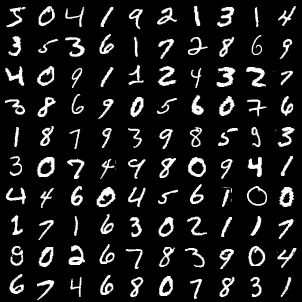
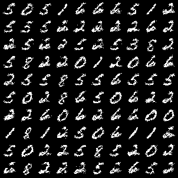

# rbm
This is the simple implementation of restricted boltzmann machine.  This code is inspired by [Deeplearning.net RBM tutorial](https://web.archive.org/web/20201111205044/http://deeplearning.net/tutorial/rbm.html) and [RBM pytorch by bacnguyencong](https://github.com/bacnguyencong/rbm-pytorch) 
This implements k-contrastive divergence (kCD) and k-persistent contrastive divergence (kPCD)

## Contribution
Simple implementation of kPCD in pytorch.  The major difference with the existing reference code is following. 

- [Deeplearning.net RBM tutorial](https://web.archive.org/web/20201111205044/http://deeplearning.net/tutorial/rbm.html) is in Theano.  This is in pytorch. 
- [RBM pytorch by bacnguyencong](https://github.com/bacnguyencong/rbm-pytorch)  is using only CD.  This implements PCD on top of it. 

## Reference 
- Hinton, Geoffrey E. "Training products of experts by minimizing contrastive divergence." Neural computation 14.8 (2002): 1771-1800. 
- Tieleman, Tijmen. "Training restricted Boltzmann machines using approximations to the likelihood gradient." Proceedings of the 25th international conference on Machine learning. 2008. 

## Output sample

Original Test MNIST images

Persistent Contrastive Divergence

